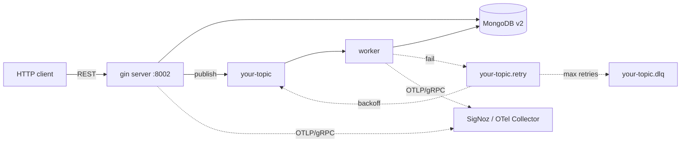

# go-mongo-boilerplate

[](https://goreportcard.com/report/github.com/rock288/go-mongo-boilerplate)


[](LICENSE)
[](https://github.com/rock288/go-mongo-boilerplate/stargazers)

> Production-grade Go microservice template — **Gin + MongoDB v2 + Kafka/SQS + OpenTelemetry**, wired with `google/wire`, mocked with `mockery v3`, shipped as distroless Docker.

[**Use this template →**](https://github.com/rock288/go-mongo-boilerplate/generate)

Clone, rename the module path, run `make scaffold name=Order` — you have a service that already knows how to log with trace IDs, retry messages into a DLQ across Kafka or SQS, scrub SSRF-unsafe outbound calls, and pass a readiness probe.

## 🎯 Why this template

Most Go boilerplates solve one piece. This one bundles the boring parts you'd otherwise reinvent on day 4 of every project, with strong opinions on the trade-offs:

- **Real observability out of the box** — slog auto-injects `trace_id`/`span_id`, Mongo has a custom OTel `CommandMonitor` (no official package exists yet), Kafka/SQS propagate W3C `traceparent` end-to-end. Plug into SigNoz or any OTLP collector.
- **Retry / DLQ done right on both brokers** — Kafka and SQS ship with identical 3-queue (`main` / `.retry` / `.dlq`) routing, idempotency key auto-generation, attacker-controlled header sanitization, and a sample-on-failure rule so retries always show on dashboards.
- **AI-driven development ready** — `CLAUDE.md` + `AGENTS.md` give Claude Code / Cursor / Aider the conventions, patterns, and "add a feature" walkthrough so agents stop cargo-culting and start matching your repo's style.

## ✨ What you get

- 🧱 **Clean layout** — package-by-feature (`internal/<feature>/`) with a shared `internal/platform/` infra layer
- 🔌 **Compile-time DI** — `google/wire`; DI errors caught at build time, no runtime reflection
- 🧪 **Test-ready** — `mockery v3` mocks generated, table-driven examples, race detector target, file-per-production-file layout
- 🗄️ **MongoDB v2** — new official driver, custom OTel `CommandMonitor`, JSON migrations
- 📨 **Kafka + SQS with retry/DLQ** — `twmb/franz-go` and `aws-sdk-go-v2`, jittered backoff, sanitized headers, W3C trace propagation, identical handler contract
- 🔭 **Observability** — OTel SDK → SigNoz (self-host or cloud); slog auto-inject `trace_id`/`span_id`
- 🛡️ **Resilience built-in** — circuit breaker (gobreaker v2), retry (backoff v5), rate limiter, SSRF-safe HTTP client
- ❤️ **Health split** — `/healthz` (liveness) vs `/readyz` (readiness, fail-after-N)
- ⚙️ **Config** — `koanf` YAML + `APP_*` env overrides, boot-time validation
- 🐳 **Distroless Docker** — multi-stage, `TARGET=server|worker|migrate`, healthcheck via binary subcommand
- 🔐 **Supply-chain hygiene** — `govulncheck`, `gitleaks`, `trivy` in `make ci`
- 🤖 **AI-agent friendly** — `CLAUDE.md`, `AGENTS.md`, `make scaffold name=X` to clone a feature template

## 🗺️ Architecture at a glance



Topic name is illustrative — default in `config/config.yaml` is `user-events`; retry/DLQ suffixes (`.retry`, `.dlq`) are configurable. Server (HTTP API) and worker (Kafka consumer) share `internal/<feature>/` services & `internal/platform/` infra; both ship traces/logs/metrics to the same OTel endpoint.

## 🚀 Use as a template

**Recommended — interactive bootstrap CLI:**

```bash
# 1. Clone (or "Use this template" on GitHub)
git clone https://github.com/<you>/go-mongo-boilerplate my-service
cd my-service

# 2. Run the bootstrap — rename module, pick features to keep, regen wire/mocks.
#    Self-destructs after a successful run.
make init                    # or: cd cmd/init && go run . --root=../..
```

The CLI lets you keep/drop Kafka, SQS, Observability (OTel/SigNoz), and the user/role sample features. Pass `--non-interactive` with `--no-kafka` / `--no-sqs` / `--no-observability` / `--no-samples` and `--module=github.com/you/svc` to script it.

**One-shot.** To re-add a feature you stripped, copy the relevant block from the upstream template repo — there is no rollback.

<details><summary><strong>Example: interactive run</strong></summary>

```text
$ make init
cd cmd/init && go run . --root=../..

┌ New module path ────────────────────────────────────────┐
│ > github.com/acme/orderservice                          │
│   e.g. github.com/yourorg/your-service                  │
└─────────────────────────────────────────────────────────┘

┌ Features to keep ───────────────────────────────────────┐
│ Toggle to KEEP; unchecked items are stripped            │
│   [✓] Kafka (message broker)                            │
│   [ ] AWS SQS (second message broker)                   │
│   [✓] Observability (OTel + SigNoz)                     │
│   [✓] Sample features (user, role)                      │
└─────────────────────────────────────────────────────────┘

wire: github.com/acme/orderservice/cmd/server: wrote …/cmd/server/wire_gen.go
wire: github.com/acme/orderservice/cmd/worker: wrote …/cmd/worker/wire_gen.go
mockery v3.7.0 — wrote 4 mocks

✓ Bootstrap complete
  Module: github.com/acme/orderservice
  Features kept:    kafka, observability, samples
  Features removed: sqs

Next steps:
  make migrate-up   # apply Mongo migrations
  make run          # start the HTTP server
  make worker       # start the message consumer
```

</details>

<details><summary><strong>Example: scriptable / CI</strong></summary>

```bash
git clone https://github.com/rock288/go-mongo-boilerplate my-service
cd my-service
cd cmd/init && go run . --root=../.. \
  --non-interactive --force \
  --module=github.com/acme/orderservice \
  --no-sqs --no-observability
```

</details>

<details><summary><strong>Manual alternative</strong> (skips feature trim)</summary>

```bash
NEW_MODULE=github.com/<you>/my-service
OLD_MODULE=github.com/rock288/go-mongo-boilerplate
go mod edit -module=$NEW_MODULE
grep -rl "$OLD_MODULE" --include='*.go' \
  | xargs perl -pi -e "s|$OLD_MODULE|$NEW_MODULE|g"
rm -rf .git && git init && git add . && git commit -m "chore: init from boilerplate"
make wire && make mocks && make test
```

</details>

**Full bootstrap guide** — toggle reference, troubleshooting, what `make init` actually does: see [`docs/bootstrap.md`](docs/bootstrap.md).

### After init

```bash
cp .env.example .env
docker-compose up -d                           # mongo (+ kafka / SQS / signoz if kept)
make migrate-up                                # apply Mongo migrations
make run                                       # http://localhost:8002/ping
make worker                                    # if you kept kafka or sqs
```

`make wire`, `make mocks`, `make test` already ran inside `make init`. The first-time tool installs (`wire`, `mockery v3`, `migrate`) are documented in [`docs/bootstrap.md`](docs/bootstrap.md#quickstart).

## 🛠️ Stack

| Concern | Choice |
|---|---|
| Language | Go **1.25**+ |
| Web | [gin](https://github.com/gin-gonic/gin) v1.12+ |
| Database | [mongo-driver/v2](https://github.com/mongodb/mongo-go-driver) |
| Migrations | [golang-migrate](https://github.com/golang-migrate/migrate) (mongodb driver, JSON files) |
| Config | [knadh/koanf](https://github.com/knadh/koanf) v2 |
| Logger | `log/slog` + auto trace ID injection |
| DI | [google/wire](https://github.com/google/wire) (compile-time) |
| Kafka | [twmb/franz-go](https://github.com/twmb/franz-go) |
| Queue (alt) | AWS SQS via [aws-sdk-go-v2](https://github.com/aws/aws-sdk-go-v2) — same retry/DLQ semantics, opt-in via `APP_SQS__CONSUMER__QUEUE_URL` |
| Observability | OpenTelemetry SDK → [SigNoz](https://signoz.io) |
| Resilience | `sony/gobreaker/v2`, `cenkalti/backoff/v5`, `golang.org/x/time/rate` |
| Mocks | [vektra/mockery](https://github.com/vektra/mockery) v3 |
| Tests | `stretchr/testify` |
| Cache (reserved) | Redis 7 in `docker-compose.yml` — config struct exists, **no client wired yet** |

## 📁 Layout

```
cmd/
  server/      # HTTP API (gin + Wire)
  worker/      # Kafka consumer (main + retry goroutines)
  migrate/     # golang-migrate runner (standalone)

internal/
  user/        # ← example feature (model, repo, service, handler, dto, routes, wire)
  role/        # ← example feature
  middleware/  # gin: recovery, request_logger, rate_limit, body_limit, timeout, cors
  platform/    # shared infra (cross-feature)
    config/        koanf loader + boot validation
    logger/        slog with trace_id/span_id injection
    database/      mongo client + OTel CommandMonitor
    httpserver/    gin engine + http.Server timeouts
    httpclient/    internal + external (SSRF-safe) clients
    kafka/         producer + consumer (retry/DLQ) + header sanitizer
    observability/ OTel SDK init (OTLP gRPC)
    health/        registry + checkers + /healthz, /readyz
    resilience/    retry + circuit breaker

config/        config.yaml (defaults; APP_* env overrides)
migrations/    *.up.json / *.down.json (golang-migrate Mongo format)
deploy/signoz/ otel-collector config for local SigNoz
docs/          architecture, runbook, CI template
Dockerfile     multi-stage distroless (TARGET=server|worker|migrate)
.mockery.yaml  mock generation config
.golangci.yml  pinned linter config
.gitleaks.toml secret-scan rules
```

See [`docs/architecture.md`](docs/architecture.md) for the full design-pattern walkthrough.

## ➕ Adding a feature

The boilerplate's main job. Workflow:

1. `mkdir internal/<feature>` → add `model.go`, `repository.go`, `service.go`, `handler.go`, `dto.go`, `routes.go`, `errors.go`, `wire.go`.
2. Export `ProviderSet` from `wire.go`. Constructors return **interfaces**, not concrete types.
3. Add the feature's interfaces to `.mockery.yaml` → `packages`.
4. Reference `<feature>.ProviderSet` from `cmd/server/wire.go` (and `cmd/worker/wire.go` if it has async handlers — see `user.NewEventHandler`).
5. Wire routes into `ProvideRouter` in `cmd/server/providers.go`.
6. `make wire && make mocks && make test`.

Copy `internal/user/` as the canonical template.

## 🧪 Testing

Unit tests only — go-kit style. Boilerplate ships canonical examples per pattern; copy them when adding real features. testcontainers + integration suites belong in YOUR repo (the one consuming this template), not in the template itself.

```bash
make test       # gotestsum-formatted go test ./...  (~5s, race-clean) + coverage.out
make test-race  # explicit race detector (gotestsum)
make test-cov   # HTML coverage report
```

**Layout** — one test file per production file (`recovery.go` ↔ `recovery_test.go`); shared helpers in `helpers_test.go`. See `internal/middleware/` as the canonical split.

**For new features:** copy `internal/user/{service,handler}_test.go` as templates. When you add a feature that needs a real Mongo/Kafka, build a per-feature integration harness (e.g. `_integration_test.go` with build tag) — don't pre-build infrastructure.

**No coverage gate** — boilerplate metrics aren't meaningful. Set up `golangci-lint` and `govulncheck` in `make ci`; add a coverage gate after you've shipped real features.

## ⚙️ Config

`config/config.yaml` carries defaults. Override **any** key with `APP_<SECTION>__<KEY>` (double underscore for nesting — koanf convention):

```bash
APP_SERVER__PORT=9090 make run
APP_MONGO__URI=mongodb://prod-host:27017 ./bin/server
APP_OBSERVABILITY__SAMPLE_RATIO=0.1 ./bin/server
```

`Config.Validate()` runs at boot and refuses unsafe combos:
- `observability.enabled=true && insecure=false` requires a real `ingestion_key`.
- `cors.allow_credentials=true` is incompatible with `"*"` in `allowed_origins`.

> Exception: `cmd/migrate` reads `MONGO_URI` / `MONGO_DATABASE` directly (no `APP_` prefix) so it can run without loading the koanf tree.

<!-- feature:observability:start -->
## 🔭 Observability

```bash
# Local SigNoz (~2GB RAM for ClickHouse)
make signoz-up
# Visit http://localhost:3301

# Point your app at it
APP_OBSERVABILITY__ENABLED=true \
APP_OBSERVABILITY__ENDPOINT=localhost:4317 \
APP_OBSERVABILITY__INSECURE=true \
make run

# Hit an endpoint and check the Traces tab
curl -X POST http://localhost:8002/api/v1/users/register \
  -H 'Content-Type: application/json' \
  -d '{"email":"a@b.c","user_name":"alice","purpose":"demo"}'
```

**SigNoz Cloud:**
```bash
APP_OBSERVABILITY__ENABLED=true
APP_OBSERVABILITY__ENDPOINT=ingest.<region>.signoz.cloud:443
APP_OBSERVABILITY__INSECURE=false
APP_OBSERVABILITY__INGESTION_KEY=<key>
APP_OBSERVABILITY__SAMPLE_RATIO=0.1
```
<!-- feature:observability:end -->

<!-- feature:kafka:start -->
## 📨 Kafka retry / DLQ

Handler contract — return:
- `nil` → offset committed
- `kafka.ErrNonRetryable` → straight to DLQ
- `context.Canceled` → no republish, no commit
- any other error → retry topic, exponential backoff, then DLQ after `MaxRetries`

```
<topic> ──fail──> <topic>.retry ──(retry consumer, backoff)──> <topic>
                       │
                       └── MaxRetries / ErrNonRetryable ──> <topic>.dlq
```

`<topic>` defaults to `user-events` (configurable via `APP_KAFKA__TOPIC`); suffixes `.retry` / `.dlq` come from `APP_KAFKA__CONSUMER__RETRY_SUFFIX` / `DLQ_SUFFIX`.

Inbound `x-retry-count` / `x-error-reason` headers are stripped on republish to prevent attacker tampering. DLQ error reason is sanitized to 256 ASCII chars.
<!-- feature:kafka:end -->

## 🌐 API (example)

| Method | Path | Notes |
|---|---|---|
| `GET`  | `/healthz` | liveness; 200 always |
| `GET`  | `/readyz` | readiness; 200 / 503 |
| `GET`  | `/internal/readyz` | per-check detail (internal network only) |
| `GET`  | `/ping` | smoke |
| `POST` | `/api/v1/users/register` | `{email, user_name, purpose}` |
| `GET`  | `/api/v1/users` | cursor pagination — `?cursor=…&limit=…` |
| `POST` | `/api/v1/roles` | `{name, description?}` |
| `GET`  | `/api/v1/roles` | list |
| `GET`  | `/api/v1/roles/:id` | by id |

Sample feature — replace with your own. Full contract: [`docs/api.openapi.yaml`](docs/api.openapi.yaml).

All error responses use a shared envelope:

```json
{ "error": { "code": "CONFLICT", "message": "user already exists" } }
```

All responses include an `X-Request-ID` header (echoed from request, or a fresh UUID).

**Pagination envelope** (`internal/platform/pagination`):

```json
{
  "items": [ /* T */ ],
  "next_cursor": "eyJsYXN0X2lkIjoi...",
  "has_more": true
}
```

Pass `next_cursor` as `?cursor=` on the next request. `limit` defaults to 20, capped at 100. Cursors are opaque base64(JSON) — not signed; wrap with HMAC if tampering matters.

## 🐳 Deployment

**Docker:**
```bash
make docker-build VERSION=v1.0.0
docker run --rm -p 8002:8002 \
  -e APP_MONGO__URI=mongodb://host.docker.internal:27017 \
  go-mongo-boilerplate-server:v1.0.0
```

**Kubernetes probes:**
```yaml
livenessProbe:
  httpGet: { path: /healthz, port: 8002 }
  periodSeconds: 10
readinessProbe:
  httpGet: { path: /readyz, port: 8002 }
  periodSeconds: 5
  failureThreshold: 3
```

<!-- feature:worker:start -->
**Worker:** exposes a tiny HTTP listener on `APP_WORKER__HEALTH_PORT` (default `8081`) for the same probes.
<!-- feature:worker:end -->

## 🧰 Make targets

```bash
make run               # cmd/server on :8002
make dev               # cmd/server with air hot-reload (auto-installed)
# feature:worker:start
make worker            # cmd/worker (Kafka consumer)
make dev-worker        # cmd/worker with air hot-reload
# feature:worker:end
make build             # server/worker/migrate → ./bin/ with version ldflags
make migrate-up        # apply migrations
make wire              # regenerate Wire DI graph
make mocks             # regenerate mockery interfaces
make test              # gotestsum (auto-installed) + coverage.out
make test-race         # gotestsum -- -race
make test-cov          # open HTML coverage report
make lint              # golangci-lint (pinned, auto-installed)
make vuln              # govulncheck
make secrets           # gitleaks
make ci                # lint + test + test-race + vuln + secrets
make hooks             # install lefthook pre-commit / pre-push hooks
# feature:samples:start
make scaffold name=X   # clone internal/user → internal/x with rename
# feature:samples:end
make docker-build      # 3 distroless images
make docker-scan       # trivy (HIGH/CRITICAL fail)
# feature:observability:start
make signoz-up         # local SigNoz at :3301
# feature:observability:end
# feature:sqs:start
make localstack-up     # local SQS via LocalStack at :4566
make sqs-create-queues # bootstrap dev queues (LocalStack only)
# feature:sqs:end
```

## 🪝 Pre-commit hooks (optional)

The repo ships a [lefthook](https://github.com/evilmartians/lefthook) config (`lefthook.yml`). It runs gofmt, golangci-lint (on changed files), and gitleaks before each commit, plus `make test` before push.

```bash
brew install lefthook
make hooks             # one-time install per clone
```

Bypass with `git commit --no-verify` when needed — CI remains the hard gate.

## 🩺 Troubleshooting

| Symptom | Check |
|---|---|
| `/readyz` 503, no Mongo | `docker ps`; `APP_MONGO__URI`; mongo logs |
| Traces missing in SigNoz | `APP_OBSERVABILITY__ENABLED=true`; endpoint reachable; `sample_ratio > 0` |
| `trace_id` absent in logs | log call must use `ctx` (`logger.InfoContext`) inside an active span |
| 413 on POST | `APP_SERVER__BODY_LIMIT_BYTES` |
| 429 on burst | `APP_RATE_LIMIT__PER_IP__RPS` / `BURST` |
| Slowloris connections | confirm `ReadHeaderTimeout` set (default 5s) |
| Consumer lag | check retry group `<base>-retry`; inspect `x-retry-count` on DLQ |
| Kafka degraded but `/readyz` 200 | by design — Kafka is `SeverityDegraded`; see `/internal/readyz` |

## 🚫 Intentionally NOT included (YAGNI)

Add when you actually need them — boilerplates rot from speculative features:

- **Auth/JWT/OAuth** — every project's auth story is different; drop in `internal/auth/` when you decide.
- **Outbox pattern** — only relevant if you require atomic DB-write + Kafka-publish.
- **CQRS / event sourcing** — add when read/write models genuinely diverge.
- **Multi-tenancy** — bake in at the model layer, not retrofitted from a generic boilerplate.
- **API versioning layout (`v1/`, `v2/`)** — add the day you ship v2.
- **gRPC server** — Gin only; add `cmd/grpc/` + reuse the same service layer when needed.

## 📚 More

- [`docs/architecture.md`](docs/architecture.md) — full structure + design-pattern assessment
- [`docs/runbook.md`](docs/runbook.md) — operational playbook
- [`docs/ci-template.md`](docs/ci-template.md) — CI pipeline template
- [`CLAUDE.md`](CLAUDE.md) — conventions for AI agents

## 🤝 Contributing

PRs welcome. Before opening one:

1. Read [`CLAUDE.md`](CLAUDE.md) for naming / DI / context / error conventions.
2. `make ci` must pass locally (`lint + test + test-race + vuln + secrets`).
3. New interfaces → add to `.mockery.yaml` and run `make mocks`.
4. Wire changes → run `make wire`, commit `wire_gen.go`.

Bug reports: open an issue with repro steps + `go version` + relevant logs (redact secrets).

## 📄 License

No `LICENSE` file is checked in yet. The intended license is **MIT** — add a `LICENSE` file when forking, or open an issue if you need a different one before this gets sorted upstream.
